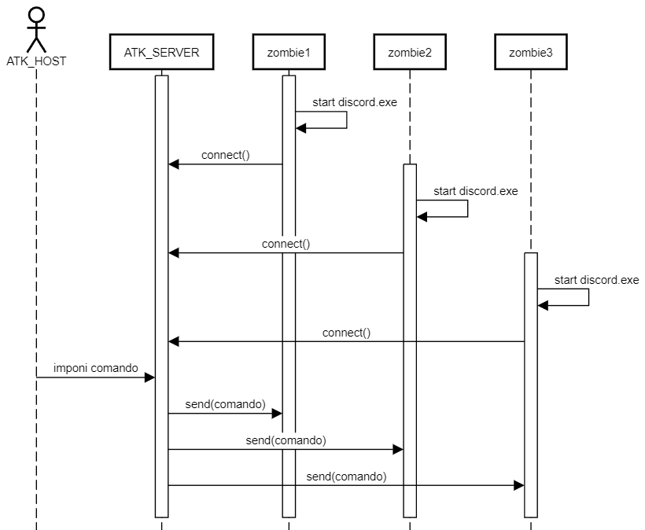

# BOTNET via DISCORD DLL LOAD ORDER HIJACKING

# Processo del progetto

## 1. Costruire dll malevola

E' stata utilizzata la dll `WSL_32.dll` per utilizzare le socket nella dll malevola.

La dll malevola sovrascrive il comportamento di `UMPDC.dll`. è stata scelta tale dll tramite un processo iterativo, provando tutte le possibili dll che venivano cercate prima nel path `%localappdata%`. Lì è stato messa la dll malevola. Quindi verrà caricata la nostra invece che l'originale `UMPDC.dll`, localizzata in `C:\Windows\SysWOW64\umpdc.dll`.

## 2. Injection di dll malevola su discord

Spostamento di dll malevola in cartella `C:\Users\<USER>\AppData\Local\Discord\app-<VERSION>`.
Se ci sono più versioni, lo script che sposta la dll deve copiare al dll in tutte le cartelle corrispondenti a versioni differenti di discord.

## 3. Far partire `server.py`

L'attaccante fa partire il server.

## 4. Far partire `discord.exe` 

A questo punto, `discord.exe` richiamerà la dll infettata `UMPDC.dll` invece che quella originale, scatenando l'attacco e collegandosi al server C2, aspettando ordini.

La causa principale a livello di codice del DLL LOAD ORDER HIJACKING è un'implementazione impropria o insicura della ricerca e del caricamento delle librerie DLL da parte dell'applicazione.

Ciò si verifica quando l'applicazione utilizza una funzione come `LoadLibrary` per caricare una DLL senza specificare un percorso completo per la libreria richiesta. Invece, l'applicazione si affida alla ricerca automatica delle DLL nelle posizioni predefinite o nelle directory di ricerca specificate.

## 5. Client utilizza normalmente discord mentre in background si è connesso al server hostato su `server.py`

In background, il server manderà al client comandi e il client li eseguirà.

I possibili comandi sono:
1. PING/PONG (per verificare che il client sia ancora vivo)
2. CMD (per effettuare CLI commands)

    Parametri:
    * `command`
3. GET HTTP REQUEST (DDoS)
    
    Parametri:
    * `website`
    * `req/min`
    * `minutes`

